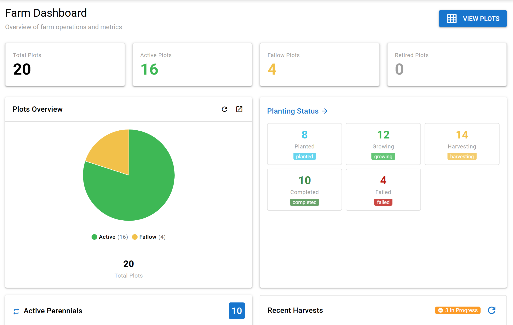
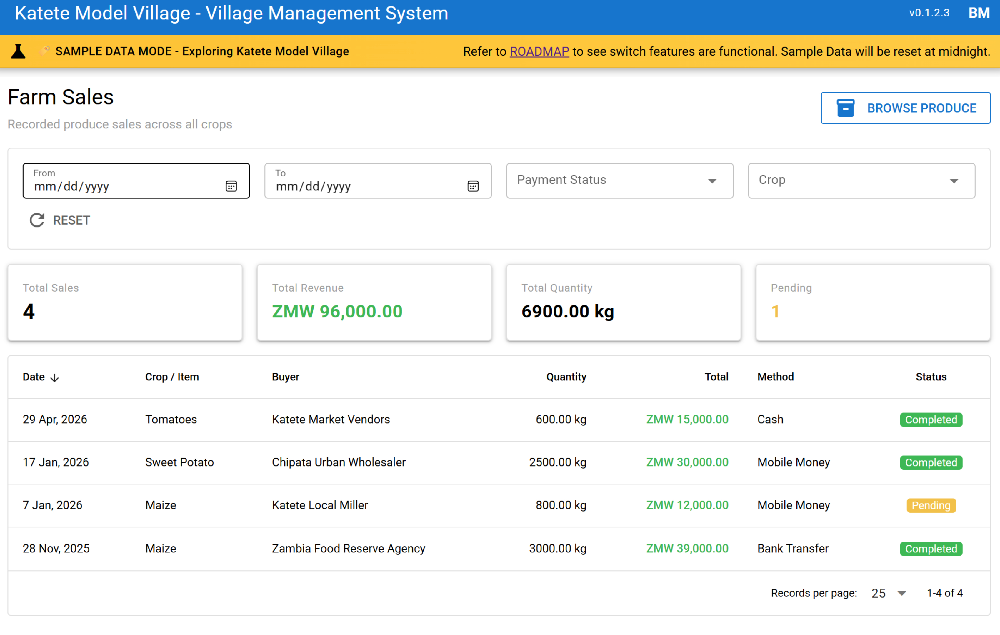
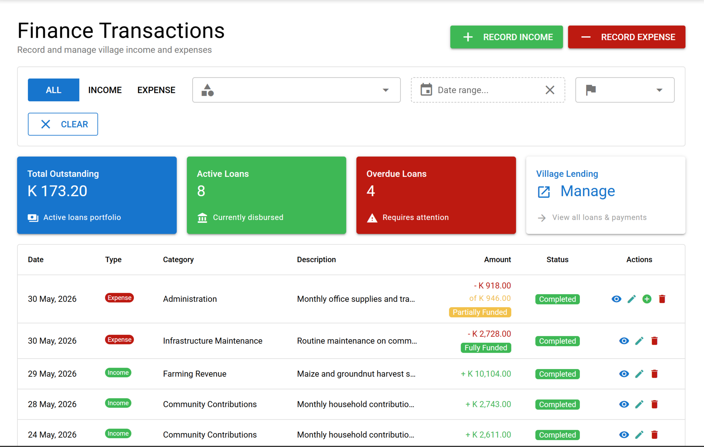
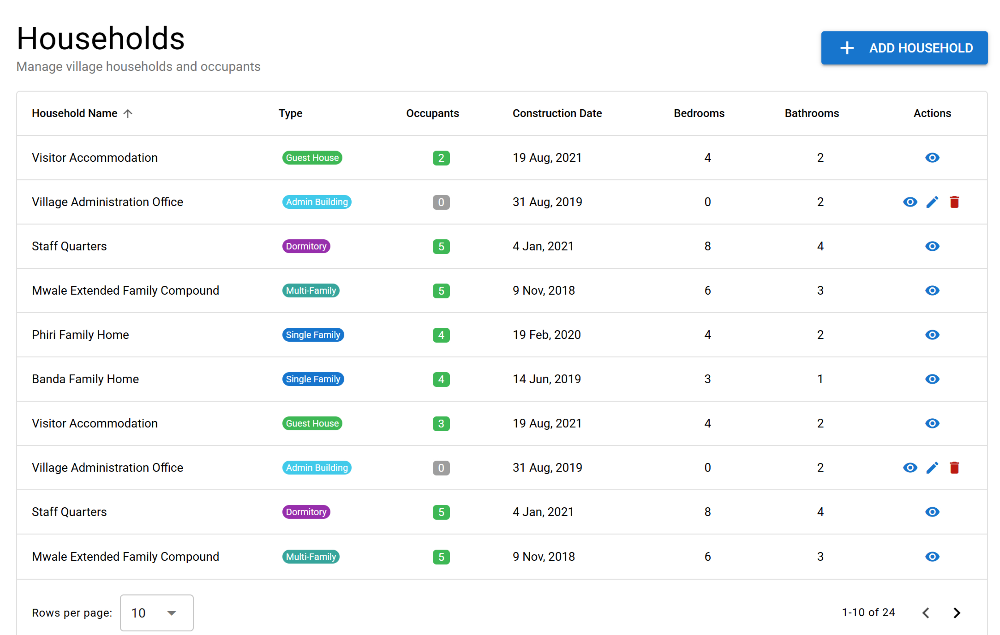
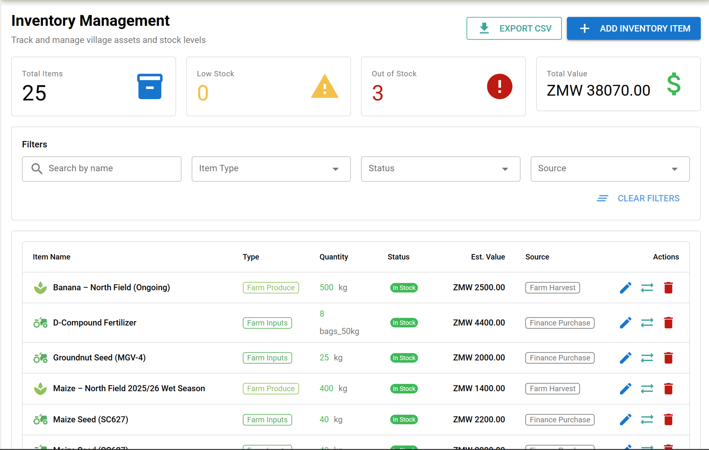
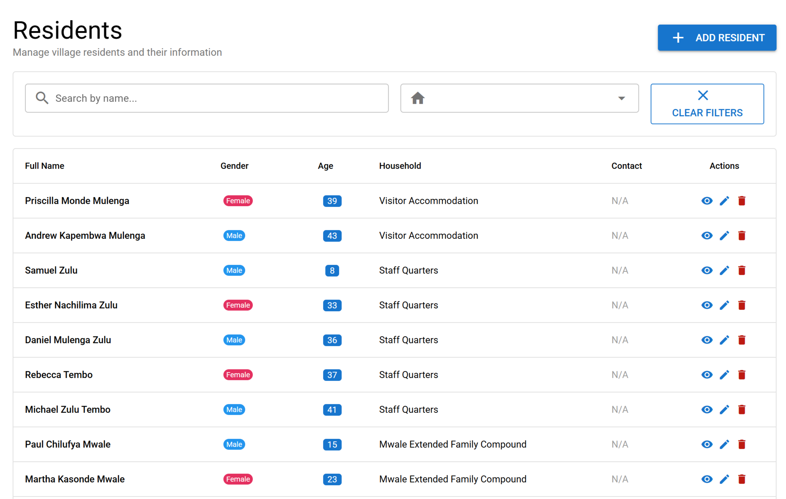

# Village Management System

An open-source web platform to transform independent communities from memory-based operations into data-driven, systematically managed operations.

## Background

While serving as a Peace Corps Volunteer in rural Zambia, I observed that many rural villages lack proper record keeping systems, mostly for their agricultural operations. This leads to great uncertainties in ROI (return on investment) calculations, since farmers don't see the cost of inputs (seed costs, fertilizer, any hired labor, etc.) compared to their yields and the revenue generated from their harvests.

Having a background in software development, I wanted to create a solution that would help such communities transition from memory-based operations to data-driven, systematically managed communities. I expanded the idea of village management to include not just agricultural operations, but also community services, education, healthcare, and other aspects of village life.

## Live Demo

**[https://village.ideacollab.app](https://village.ideacollab.app)**

| Field    | Value               |
| -------- | ------------------- |
| Email    | `brian@village.app` |
| Password | `Village_app2026`   |

> The demo runs on sample data for the Katete Model Village. Data will be reset periodically.

## Screenshots

<table>
  <tr>
    <td align="center">
      <a href="screenshots/farm_dashboard.jpg" target="_blank"></a><br/>
      <sub><b>Farm Dashboard</b></sub>
    </td>
    <td align="center">
      <a href="screenshots/farm_sales.jpg" target="_blank"></a><br/>
      <sub><b>Farm Sales</b></sub>
    </td>
    <td align="center">
      <a href="screenshots/finance_transactions.jpg" target="_blank"></a><br/>
      <sub><b>Finance Transactions</b></sub>
    </td>
  </tr>
  <tr>
    <td align="center">
      <a href="screenshots/households.jpg" target="_blank"></a><br/>
      <sub><b>Households</b></sub>
    </td>
    <td align="center">
      <a href="screenshots/inventory_manage.jpg" target="_blank"></a><br/>
      <sub><b>Inventory Management</b></sub>
    </td>
    <td align="center">
      <a href="screenshots/residents.jpg" target="_blank"></a><br/>
      <sub><b>Residents</b></sub>
    </td>
  </tr>
</table>

## Requirements

Install these required tools before proceeding:

- **Docker Desktop** - For self-hosted Appwrite ([docker.com](https://www.docker.com/products/docker-desktop/))
- **Node.js** (v20 LTS+) - JavaScript runtime ([nodejs.org](https://nodejs.org/))
- **Git** - Version control ([git-scm.com](https://git-scm.com/downloads))
- **Yarn** (recommended) or npm - `npm install -g yarn`
- **Quasar CLI** - `npm install -g @quasar/cli`
- **Appwrite CLI** - `npm install -g appwrite-cli`

**Appwrite Account:** [cloud.appwrite.io](https://cloud.appwrite.io) (free tier) or self-hosted via Docker (instructions below).

## Features

- **Core:** Residents, Households, Finance, Inventory, Calendar, Storage
- **Optional:** Farm Management, School Administration, Guest Programs, Equipment Tracking, Vendor Management, Energy Monitoring
- **Offline-First:** 2-day offline buffer with automatic sync
- **Role-Based:** 11 user roles with granular permissions
- **Mobile-Responsive:** Desktop, tablet, and mobile optimized

## Installation

### 1. Set Up Appwrite

This project uses [Appwrite](https://appwrite.io) as its backend.

**Quick path:** Use [Appwrite Cloud](https://cloud.appwrite.io) (skip to Step 2)

**Self-hosted:** Requires Docker. See [Docker install docs](https://docs.docker.com/get-docker/) then run:

```bash
# Windows (PowerShell)
docker run -it --rm `
    --volume /var/run/docker.sock:/var/run/docker.sock `
    --volume "${pwd}/appwrite:/usr/src/code/appwrite:rw" `
    --entrypoint="install" `
    appwrite/appwrite:1.8.1

# macOS/Linux
docker run -it --rm \
    --volume /var/run/docker.sock:/var/run/docker.sock \
    --volume "$(pwd)"/appwrite:/usr/src/code/appwrite:rw \
    --entrypoint="install" \
    appwrite/appwrite:1.8.1
```

**Prompts:** HTTP port (Enter for 80), HTTPS port (Enter for 443), hostname (`localhost`).

Once finished, Appwrite runs at `http://localhost` (or your chosen port). Create an admin account and project. Save the **Project ID**.

### 2. Clone and Install

```bash
git clone https://github.com/kamalsprasad/village-management.git
cd village-management
yarn  # or npm install
```

### 3. Configure Environment

Copy `.env.example` to `.env` and update your credentials:

```bash
cp .env.example .env
```

```env
# Appwrite Cloud (recommended):
VITE_APPWRITE_ENDPOINT=https://cloud.appwrite.io/v1

# Self-hosted:
# VITE_APPWRITE_ENDPOINT=http://localhost/v1

VITE_APPWRITE_PROJECT_ID=your-project-id-here
```

**Note:** Variables need `VITE_` prefix for Vite to expose them to the client.

### 4. Create API Key

1. In Appwrite Console, go to **Settings** → **API Keys**
2. Click **"Create API Key"**, name it `Database Setup & Functions`
3. Select scopes: **Database** (all), **Users** (read)
4. Copy the key and add to `.env`:

```env
VITE_APPWRITE_API_KEY=your-api-key-here
```

### 5. Set Up Database

```bash
npm run setup:appwrite
```

Creates all tables, columns, indexes, and permissions. For manual setup, see [appwrite_setup/README.md](appwrite_setup/README.md).

### 5.5 Seed Roles

```bash
npm run seed:roles
```

Creates default roles (Admin, Farmer, Extension Officer, etc.) in the database. This is necessary for a smooth OOBE (Out of the Box) user experience.

### 6. Deploy Functions

Two server functions are required.

**Via Appwrite CLI** (config included at `server/appwrite.config.json`):

```bash
cd server/
appwrite login
appwrite push functions
```

Select both functions when prompted.

**Configure function environment variables** in Appwrite Console (**Functions** → [Function] → **Settings**):

- `APPWRITE_ENDPOINT` (`http://host.docker.internal/v1` for self-hosted, or cloud endpoint)
- `APPWRITE_PROJECT_ID`
- `APPWRITE_API_KEY`

**Note:** Set function env vars in the Appwrite Console, not `.env`. Functions run in isolated containers.

**Update `.env` with Function IDs:**

```env
VITE_APPWRITE_FUNCTION_CHECK_USERS=checkUsersExist
VITE_APPWRITE_FUNCTION_WIPE_DATA=wipeAllData
```

For manual deployment, see [appwrite_setup/QUICK_START.md](appwrite_setup/QUICK_START.md).

### 7. Start Development Server

```bash
quasar dev -m ssr
```

Opens at `http://localhost:9100`.

---

## Database Schema

See [DATABASE_SCHEMA.md](DATABASE_SCHEMA.md) for table definitions, relationships, indexes, and example queries.

## Tech Stack

- **Frontend:** Quasar Framework v2 (Vue 3 + Vite + SSR)
- **Backend:** Appwrite v21.2.1 (Auth, Database, Storage, Functions)
- **State Management:** Pinia
- **Offline Sync:** IndexedDB + Dexie.js
- **Charts:** Chart.js v4.5.1
- **Calendar:** vue-cal v5

## Roadmap

**35 of 50 MVP features complete (70%)**

| Status      | Epic       | Highlights                                                              |
| ----------- | ---------- | ----------------------------------------------------------------------- |
| ✅ Complete | Foundation | Auth, RBAC, Households, Residents, Dashboard                            |
| ✅ Complete | Finance    | Income/expense tracking, lending, reports                               |
| ✅ Complete | Inventory  | Core inventory, auto-stock from purchases                               |
| ✅ Complete | Farm       | Plot management, planting→harvest→sales, profitability & yield analysis |
| 🔄 Next     | School     | Student registration, grades, attendance _(not started)_                |
| ⏳ Planned  | Calendar   | Events, resource bookings                                               |
| ⏳ Planned  | Storage    | Documents, media, forms                                                 |

**Recently shipped:** Farm sales recording with finance integration, ROI/profitability reports, yield trends & agronomic alerts.

See [ROADMAP.md](ROADMAP.md) for full epic-by-epic breakdown.

## Sample Data

The setup wizard offers **"Explore with Sample Data"** to load the Katete Model Village dataset (6 households, 20+ residents, 3 council members).

**Wipe sample data:** Click "Start Fresh" in the banner, type `DELETE EVERYTHING`, confirm. (Admin only.) You'll need to manually create "Village Administrator" team with team id "village_administrators" in Appwrite Auth console and add the admin user (created at setup) to this team.

## Contributing

Code contributions, questions, and bug reports are welcome! Please follow the project's coding standards and submit pull requests through GitHub.

## If you'd like to financially support this project. :)

<a class="bmc-button" target="_blank" href="https://www.buymeacoffee.com/ksp"><span style="margin-left:5px;font-size:28px !important;">Buy me a coffee.</span></a>

## AI Usage

This project is being built with the help of AI assistants. The following AI tools were used:

- **[WindSurf](https://www.windsurf.com/)** - AI-powered code editor for development and debugging
- **[BMAD Method](https://github.com/bmad-code-org/BMAD-METHOD)** - AI-powered coding methodology for development and debugging
