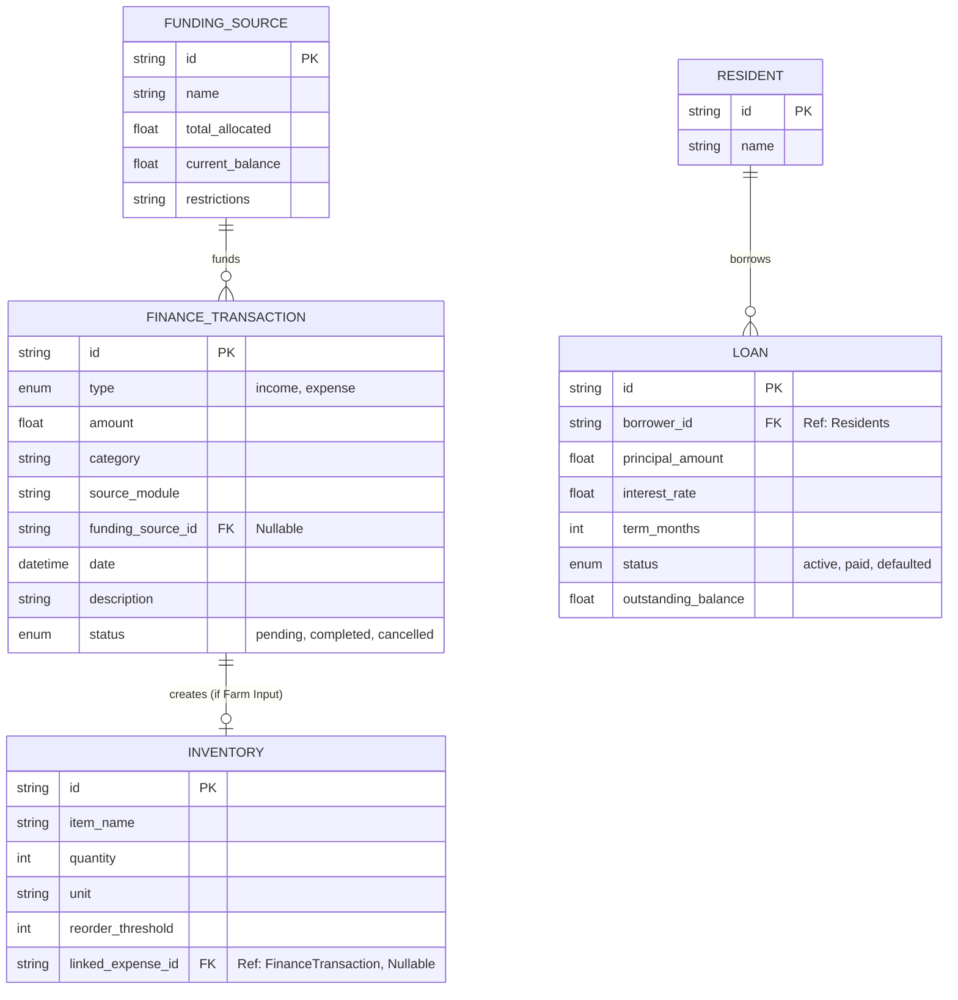
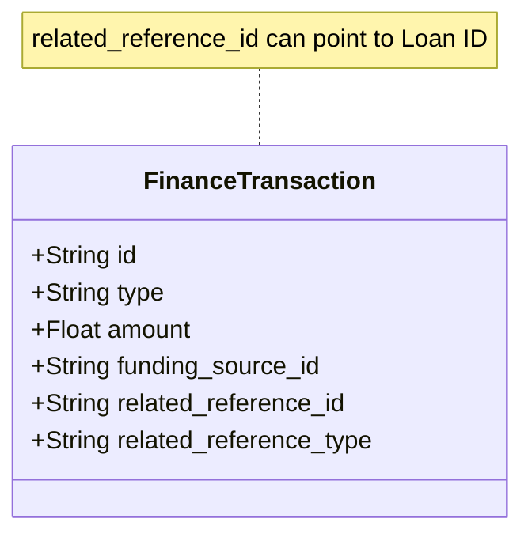

# Epic 2 Schema: Financial Management & Inventory

This diagram visualizes the data models and relationships for the Financial Management and Inventory Tracking epic.

## Key Relationships & Constraints

1.  **Funding Source Tracking:**
    - `FINANCE_TRANSACTION` links to `FUNDING_SOURCE` via `funding_source_id`.
    - **Constraint:** When an expense is recorded with a `funding_source_id`, the `current_balance` of that source must be decremented.

2.  **Inventory Integration:**
    - `INVENTORY` links to `FINANCE_TRANSACTION` via `linked_expense_id`.
    - **Workflow:** An expense with category "Farm Inputs" triggers the creation of an `INVENTORY` item. The `linked_expense_id` provides traceability back to the cost.

3.  **Lending:**
    - `LOAN` links to `RESIDENT` (from Epic 1) via `borrower_id`.
    - **Workflow:** Loan repayments will be recorded as `FINANCE_TRANSACTION` (Income) records, likely linked back to the `LOAN` (we might need a `loan_id` on transaction or a separate join table, but for MVP, a `reference_id` or description in Transaction might suffice, or we add `loan_id` to Transaction schema).

    > _Self-Correction:_ The ERD highlights a potential missing link. How do we link a Repayment Transaction back to the Loan?
    > _Recommendation:_ Add `related_entity_id` and `related_entity_type` to `FINANCE_TRANSACTION` for polymorphic associations (Loans, etc.), OR explicitly add `loan_id`. Given Appwrite's NoSQL nature, explicit nullable fields or a generic reference ID is common. Let's stick to `reference_id` in Transaction for now, or add `loan_id` if we want strict FKs.

