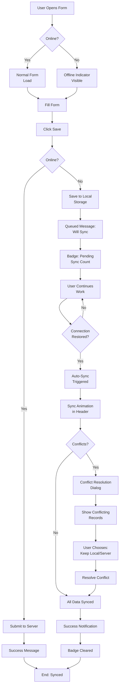
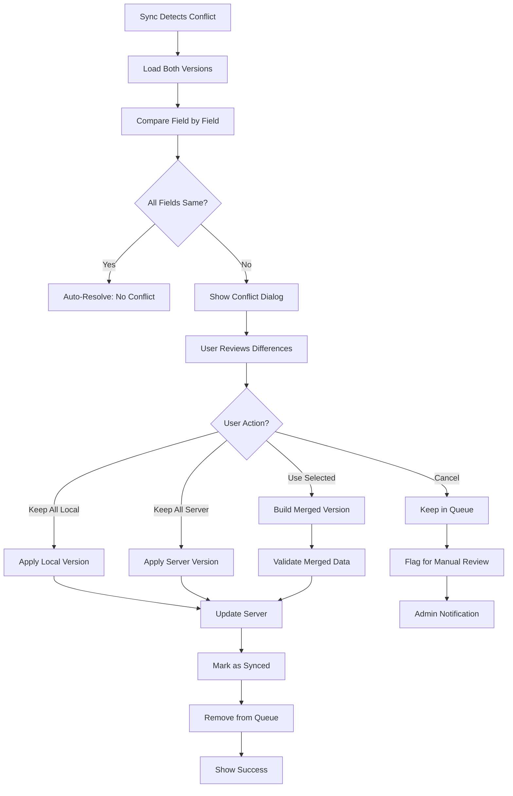
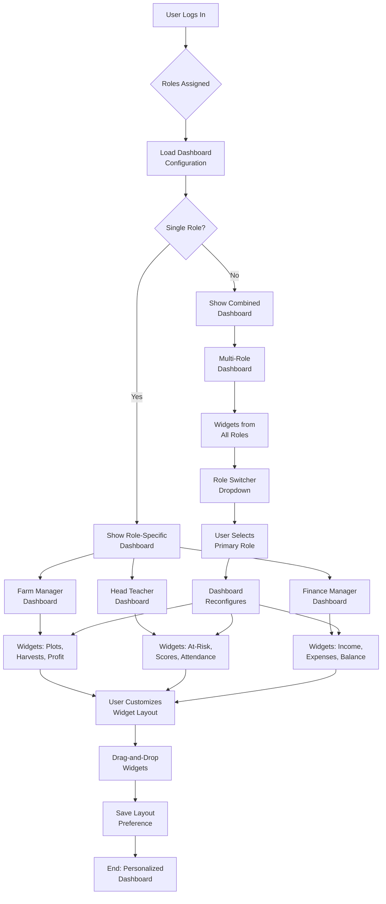

```mermaid
graph TD
    A[Farm Dashboard] --> B{Seed Available?}
    B -->|No| C[Finance Manager<br/>Records Purchase]
    C --> D[System Creates<br/>Inventory Item]
    D --> E[Notification:<br/>New Seed Added]
    B -->|Yes| F[Select Plot]
    E --> F
    
    F --> G[Click Record<br/>New Planting]
    G --> H[Planting Form]
    H --> I{Select Crop}
    I --> J[System Shows:<br/>Maturity Days]
    J --> K[Enter Planting Date]
    K --> L[Auto-Calculate<br/>Expected Harvest]
    L --> M[Select Seeds<br/>from Inventory]
    M --> N[Enter Quantity Used]
    N --> O[System Calculates<br/>Seed Cost]
    O --> P[Save Planting]
    
    P --> Q[Inventory<br/>Auto-Decrements]
    Q --> R[Plot Status:<br/>Growing]
    R --> S[Calendar Event:<br/>Expected Harvest]
    
    S --> T[Monitor Growth<br/>Weekly Dashboard]
    T --> U{Harvest Ready?}
    U -->|No| T
    U -->|Yes| V[Dashboard Alert:<br/>Ready for Harvest]
    
    V --> W[Click Record<br/>Harvest]
    W --> X{Harvest Type?}
    X -->|Single Day| Y[Enter Date<br/>+ Quantity]
    X -->|Multi-Day| Z[Enter Daily<br/>Quantities]
    X -->|Continuous| AA[Multiple Harvest<br/>Events]
    
    Y --> AB[Mark Complete]
    Z --> AB
    AA --> AB
    
    AB --> AC[System Creates<br/>Inventory Item]
    AC --> AD[Calculate Estimated<br/>Value from History]
    AD --> AE[Planting Status:<br/>Completed]
    
    AE --> AF[Negotiate Sale]
    AF --> AG[Click Record Sale<br/>on Inventory]
    AG --> AH[Sale Form]
    AH --> AI[Select Buyer<br/>from Vendors]
    AI --> AJ[Enter Quantity<br/>+ Price/kg]
    AJ --> AK[Auto-Calculate<br/>Total Amount]
    AK --> AL[Select Payment<br/>Method + Status]
    AL --> AM[Save Sale]
    
    AM --> AN[Inventory<br/>Auto-Decrements]
    AN --> AO[Finance Income<br/>Auto-Created]
    AO --> AP[Vendor History<br/>Updated]
    
    AP --> AQ[View Profitability]
    AQ --> AR[Farm Dashboard:<br/>Profit Analysis]
    AR --> AS[Revenue - Seed Cost<br/>= Profit]
    AS --> AT[Export PDF Report<br/>for Village Head]
    AT --> AU[End: Data-Driven<br/>Decision Made]
```

```mermaid
graph TD
    A[School Dashboard] --> B[Click Record<br/>Test Scores]
    B --> C[Bulk Entry Form]
    C --> D[Select: Grade,<br/>Subject, Date]
    D --> E[Spreadsheet Table:<br/>All Learners]
    E --> F[Enter Scores<br/>Tab Navigation]
    F --> G[Save All Scores]
    
    G --> H[System Calculates<br/>Class Average]
    H --> I{Any Learner<br/><50%?}
    I -->|Yes| J[Dashboard Alert:<br/>At-Risk Learner]
    I -->|No| K[End: Normal Flow]
    
    J --> L[Click At-Risk<br/>Learners Widget]
    L --> M[At-Risk Dashboard]
    M --> N[View Flagged<br/>Learner: Banda]
    N --> O[Click Learner Name]
    
    O --> P[Learner Profile]
    P --> Q[Tabs: Scores,<br/>Attendance, Interventions]
    Q --> R[Review Historical<br/>Performance]
    R --> S[Identify Pattern:<br/>Reading Issues]
    
    S --> T[Click Create<br/>Intervention]
    T --> U[Intervention Form]
    U --> V[Select Type:<br/>One-on-One Tutoring]
    V --> W[Assign Teacher:<br/>Mwape]
    W --> X[Set Frequency:<br/>3x per week]
    X --> Y[Define Focus:<br/>Reading Comprehension]
    Y --> Z[Set Schedule:<br/>Mon/Wed/Fri 3-4pm]
    Z --> AA[Save Intervention]
    
    AA --> AB[Calendar Events<br/>Auto-Created]
    AB --> AC[Teacher Notification:<br/>New Assignment]
    
    AC --> AD[Teacher Records<br/>Progress Notes]
    AD --> AE[Weekly Updates<br/>in System]
    AE --> AF[Head Teacher<br/>Reviews Dashboard]
    
    AF --> AG[Record Mid-Term<br/>Assessment]
    AG --> AH[System Shows<br/>Improvement Trend]
    AH --> AI{Improvement<br/>Sufficient?}
    AI -->|Yes| AJ[Continue Intervention]
    AI -->|No| AK[Adjust Strategy]
    
    AJ --> AL[End-of-Term<br/>Assessment]
    AL --> AM[Generate Progress<br/>Report]
    AM --> AN[Export PDF for<br/>Parent Meeting]
    AN --> AO[Conduct Teacher<br/>Peer Review]
    AO --> AP[End: Documented<br/>Success]
```

# Sustainable Model Village Management System UX/UI Specification

_Generated on 2025-10-24 by Kamal S. Prasad_

## Executive Summary

**Project:** Sustainable Model Village Management System  
**Platform:** Web application (Quasar SSR + Appwrite backend)  
**Target Users:** Village administrators in rural Zambia with limited digital literacy  
**Scale:** 50 adults initially → 1,000 by year 30  
**Deployment:** LAN-first with 2-day offline buffer, optimized for low-end devices and 3G connectivity

**Core Challenge:**  
Design an intuitive, accessible interface that enables users with basic digital literacy to manage complex village operations—agriculture, education, finance, inventory—across desktop and mobile devices in environments with intermittent connectivity.

**UX Complexity:**  
- **11 distinct user roles** (Admin, Village Head, Farm Manager, Crop Manager, Finance Manager, Head Teacher, Teacher, Events Coordinator, Resident, Learner, Guest)  
- **15+ functional modules** (6 core + 9 optional) with deep interconnections  
- **Multi-role users** requiring unified navigation and context-aware dashboards  
- **Offline-first workflows** with sync indicators and conflict resolution  
- **Mobile-responsive** design for field use (farm plots, classrooms)

**Key UX Principles (from PRD):**  
1. **Simplicity over features** – Core tasks completable within 15 minutes of training  
2. **Visual hierarchy** – Minimal text, clear iconography, contextual help  
3. **Offline resilience** – Forms work without connectivity, sync transparently  
4. **Role-based clarity** – Users see only relevant modules and actions  
5. **Data transparency** – Audit trails, donor reporting, profitability visible at a glance

---

## 1. UX Goals and Principles

### 1.1 Target User Personas

**Primary Personas:**

**1. John Banda – Farm Manager**
- **Age:** 35, Grade 10 education, basic mobile phone experience
- **Role:** Farm Manager responsible for 6 plots and 2 Crop Managers
- **Goals:** Track crop lifecycles from seed to sale, prove profitability, make data-driven planting decisions
- **Pain Points:** Previously relied on memory for costs/yields, couldn't prove ROI to Village Head, donor reports took weeks to compile manually
- **Digital Literacy:** Basic – needs clear visual cues, minimal text, forgiving error handling
- **Context:** Works in fields daily, needs mobile access, experiences intermittent connectivity
- **Key Tasks:** Record plantings, track harvests, record sales, view profitability reports

**2. Grace Mwale – Head Teacher**
- **Age:** 42, Grade 12 + teaching diploma, moderate computer experience
- **Role:** Head Teacher managing 2 teachers and 10 learners (Grades 5 and 7)
- **Goals:** Identify struggling learners early, implement interventions, track progress toward 90% in 90th percentile goal
- **Pain Points:** No systematic at-risk identification until too late, teacher accountability was checkbox exercise, manual reporting burden
- **Digital Literacy:** Moderate – comfortable with forms, needs efficient bulk data entry (test scores, attendance)
- **Context:** Office-based but mobile for classroom visits, needs quick access to learner profiles
- **Key Tasks:** Bulk record test scores/attendance, review at-risk dashboard, assign interventions, conduct teacher evaluations

**Secondary Personas:**

**3. Village Administrator (Admin/Village Head)**
- **Needs:** Cross-module visibility, donor reporting, financial oversight, system configuration
- **Digital Literacy:** Varies (basic to moderate)
- **Key Tasks:** View dashboards, generate reports, manage users, configure modules

**4. Finance Manager**
- **Needs:** Transaction recording, budget tracking, audit trails, donor fund allocation
- **Digital Literacy:** Moderate
- **Key Tasks:** Record income/expenses, track loans, generate financial reports

**5. Crop Manager**
- **Needs:** Plot-specific data entry, harvest recording for assigned plots only
- **Digital Literacy:** Basic
- **Key Tasks:** Record plantings, update planting status, record harvests

### 1.2 Usability Goals

1. **Ease of Learning**
   - Success Metric: 80% of users with basic digital literacy complete core workflows independently after 1 hour training
   - Target: Core tasks (record harvest, enter test score, log expense) completable within 15 minutes of initial training

2. **Efficiency for Frequent Tasks**
   - Success Metric: Core tasks completable in <5 minutes by trained users
   - Target: Bulk operations (test scores for entire class, multi-day harvests) use spreadsheet-style interfaces

3. **Error Prevention and Recovery**
   - Success Metric: <5% error rate on form submissions; clear recovery paths for all errors
   - Target: Validation prevents invalid data entry; draft saves prevent data loss; undo capability for critical actions

4. **Offline Resilience**
   - Success Metric: Zero data loss during offline periods; automatic sync within 5 minutes of connectivity restoration
   - Target: All forms work without connectivity; sync status always visible; conflict resolution is transparent

5. **Accessibility for Low Digital Literacy**
   - Success Metric: Keyboard navigation for all forms; 4.5:1 color contrast; screen reader support for core workflows
   - Target: Visual hierarchy with icons + labels; contextual help always available; minimal text-heavy interfaces

### 1.3 Design Principles

**1. Clarity Over Complexity**
- Show only what's needed for the current task; hide advanced features behind progressive disclosure
- Use visual hierarchy (icons, color, size) to guide attention
- Minimize cognitive load: one primary action per screen

**2. Forgiveness First**
- Enable undo for destructive actions (delete, status changes)
- Auto-save drafts to prevent data loss
- Provide clear error messages with specific recovery steps (not generic "Error occurred")
- Confirm before irreversible operations

**3. Context-Aware Intelligence**
- Auto-calculate expected dates (harvest date from planting + maturity days)
- Pre-fill forms from related data (inventory items when recording plantings)
- Suggest based on history (frequent vendors, typical prices)
- Link related records automatically (harvest → inventory → sale → finance)

**4. Visual Hierarchy Over Text**
- Use icons + short labels instead of text-heavy instructions
- Employ color-coded status indicators (green = good, yellow = warning, red = action needed)
- Present data in tables/charts over paragraphs
- Use dashboard widgets for at-a-glance insights

**5. Offline-First Mindset**
- Design every interaction to work without connectivity
- Make sync status visible but unobtrusive
- Queue actions during offline periods; process on reconnection
- Treat online connectivity as enhancement, not requirement

---

## 2. Information Architecture

### 2.1 Site Map

```
Village Management System
│
├── Dashboard (role-specific home)
│
├── CORE MODULES (always visible)
│   ├── Residents
│   │   ├── Residents List
│   │   ├── Add Resident
│   │   └── Resident Profile (detail view)
│   ├── Households
│   │   ├── Households List
│   │   ├── Add Household
│   │   └── Household Detail
│   ├── Finance
│   │   ├── Transactions (Income/Expense tabs)
│   │   ├── Record Transaction
│   │   ├── Loans
│   │   ├── Reports
│   │   └── Settings (categories, funding sources)
│   ├── Inventory
│   │   ├── Inventory List (filterable by type)
│   │   ├── Add Item
│   │   ├── Item Detail
│   │   └── Reorder Alerts
│   ├── Calendar
│   │   ├── Calendar View (month/week/day)
│   │   ├── Add Event
│   │   └── Event Detail
│   └── Storage
│       ├── My Files
│       ├── Shared Folders (by module)
│       └── Upload
│
├── OPTIONAL MODULES (if enabled)
│   ├── Farm (if enabled)
│   │   ├── Farm Dashboard
│   │   ├── Plots
│   │   │   ├── Plots List
│   │   │   ├── Add Plot
│   │   │   └── Plot Detail
│   │   │       ├── Plantings
│   │   │       ├── Harvests
│   │   │       └── Profitability
│   │   ├── Crops Database (Admin only)
│   │   ├── Sales
│   │   └── Reports (yield, profitability)
│   │
│   ├── School (if enabled)
│   │   ├── School Dashboard
│   │   ├── Learners
│   │   │   ├── Learners List
│   │   │   ├── Enroll Learner
│   │   │   └── Learner Profile
│   │   ├── Test Scores (bulk entry)
│   │   ├── Attendance (bulk entry)
│   │   ├── At-Risk Learners
│   │   ├── Interventions
│   │   ├── Teacher Evaluations
│   │   └── Reports
│   │
│   ├── Guests (if enabled)
│   │   ├── Guests List
│   │   ├── Add Guest
│   │   ├── Guest Detail
│   │   └── Conversion Alerts
│   │
│   ├── Equipment (if enabled)
│   │   ├── Equipment List
│   │   ├── Add Equipment
│   │   ├── Equipment Detail
│   │   └── Maintenance Schedule
│   │
│   ├── Vendors (if enabled)
│   │   ├── Vendors List
│   │   ├── Add Vendor
│   │   └── Vendor Detail
│   │
│   └── Energy (if enabled)
│       ├── Energy Dashboard
│       ├── Production/Consumption
│       └── Alerts
│
├── Reports (cross-module)
│   ├── Donor Reports
│   ├── Financial Summary
│   ├── Farm Performance
│   └── School Progress
│
└── Settings
    ├── Village Profile
    ├── Module Configuration
    ├── User Management (Admin only)
    ├── Roles & Permissions (Admin only)
    └── My Profile
```

**Depth Guidelines:**
- Maximum 3 levels deep for most workflows (Module → List → Detail)
- Detail pages may have sub-sections (tabs) but avoid deeper nesting
- Quick actions available from list views (Add, Filter, Export)

### 2.2 Navigation Structure

**Primary Navigation (Sidebar - Desktop / Bottom Nav - Mobile):**

**Desktop Sidebar (Left, collapsible):**
- Dashboard (home icon)
- **Core Modules** (always visible, grouped)
  - Residents (people icon)
  - Households (home icon)
  - Finance (currency icon)
  - Inventory (box icon)
  - Calendar (calendar icon)
  - Storage (folder icon)
- **Optional Modules** (only if enabled, grouped separator)
  - Farm (tractor icon)
  - School (graduation cap icon)
  - Guests (bed icon)
  - Equipment (tools icon)
  - Vendors (handshake icon)
  - Energy (lightning icon)
- Reports (chart icon)
- Settings (gear icon)

**Mobile Bottom Navigation (5 items max):**
- Dashboard (home icon)
- Primary Module (role-based: Farm for Farm Manager, School for Teacher, Finance for Finance Manager)
- Calendar (calendar icon)
- Reports (chart icon)
- More (menu icon → opens drawer with remaining modules)

**Role-Based Navigation Visibility:**

| Role | Visible Modules |
|------|----------------|
| **Admin/Village Head** | All enabled modules (full access) |
| **Farm Manager** | Dashboard, Residents, Households, Finance (farm only), Inventory (farm only), Calendar, Farm, Reports |
| **Crop Manager** | Dashboard, Calendar, Farm (assigned plots only) |
| **Head Teacher/Teacher** | Dashboard, Residents, Households, Calendar, School, Reports |
| **Finance Manager** | Dashboard, Finance, Inventory, Calendar, Reports |
| **Events Coordinator** | Dashboard, Calendar (full edit), all modules (view only) |
| **Resident** | Dashboard, Calendar (view only), Storage (personal folder) |

**Secondary Navigation:**
- **Breadcrumbs** (all detail pages): Module → List → Detail
  - Example: Farm → Plots → Maize Field A → Planting Detail
  - Clickable for quick navigation back
- **Tabs** (within detail pages): Group related information
  - Example: Plot Detail tabs: Overview, Plantings, Harvests, Profitability
- **Contextual Actions** (floating action button on mobile, toolbar on desktop)
  - Primary action always visible (e.g., "Add Plot" on Plots List)

**Mobile Navigation Strategy:**
- Bottom navigation bar fixed (5 items)
- "More" drawer slides from right, shows:
  - Remaining enabled modules
  - Settings
  - Profile
  - Logout
- Hamburger menu (top-left) for:
  - Quick filters
  - Search
  - Notifications

**Navigation States:**
- **Active module** highlighted in sidebar/bottom nav
- **Notification badges** on Calendar (upcoming events), Reports (new data), modules with alerts
- **Offline indicator** in header (persistent when offline)
- **Sync status** in header (syncing animation when active)

---

## 3. User Flows

### Flow 1: Farm Manager - Complete Crop Lifecycle Management

**User Goal:** Track maize from seed purchase through harvest to sale, proving profitability

**Entry Points:**
- Farm Dashboard (primary)
- Inventory alerts (low seed stock)
- Calendar reminder (planting season)

**Flow Diagram:**



**Key Screens & Interactions:**

1. **Planting Form**
   - Auto-populated: Plot name, size
   - Dropdown: Crop (searchable, shows maturity days on select)
   - Date picker: Planting date
   - Read-only: Expected harvest date (auto-calculated, editable icon)
   - Dropdown: Seeds from inventory (shows available quantity)
   - Number input: Quantity used (validation: cannot exceed available)
   - Read-only: Seed cost (auto-calculated)
   - Buttons: Save (primary), Cancel (secondary)

2. **Harvest Recording (Multi-Day Aggregate)**
   - Harvest type selector: Radio buttons with icons
   - Date range: Start/End dates
   - Table: Daily quantities (spreadsheet-style)
     - Columns: Date, Quantity (kg), Notes
     - Tab navigation between cells
     - Add Row button
   - Total: Auto-sum at bottom
   - Buttons: Mark Complete (primary), Save Draft (secondary)

3. **Sale Recording**
   - Pre-filled: Item name, available quantity
   - Dropdown: Buyer (from Vendors, or "Add New Buyer" option)
   - Number input: Quantity sold (validation: ≤ available)
   - Number input: Price per kg (suggestion from history)
   - Read-only: Total amount (auto-calculated, highlighted)
   - Dropdown: Payment method
   - Radio: Payment status (Paid/Pending/Partial)
   - Buttons: Record Sale (primary), Cancel (secondary)

**Success Criteria:**
- Complete flow in <15 minutes (trained user)
- Zero manual calculations required
- All cross-module links automatic
- Clear visual feedback at each step

**Error States:**
- Insufficient seed inventory → Alert with link to Finance module
- Harvest quantity below typical → Warning: "Yield below typical for this crop. Confirm?"
- Sale price differs significantly → Warning: "Price differs from average. Continue?"
- Offline during any step → Save draft locally, sync when online

---

### Flow 2: Head Teacher - Identify & Intervene with Struggling Learner

**User Goal:** Identify struggling learners early and implement intervention strategies

**Entry Points:**
- School Dashboard (at-risk widget)
- After recording test scores (automatic flagging)
- Weekly review routine

**Flow Diagram:**



**Key Screens & Interactions:**

1. **Bulk Test Score Entry**
   - Filters: Grade (dropdown), Subject (dropdown), Assessment Type, Date
   - Table: Spreadsheet-style
     - Columns: Learner Name (read-only), Score (editable), Notes (optional)
     - Tab navigation between score cells
     - Visual validation: Red highlight if <50%, Yellow if 50-60%
   - Summary: Class average (auto-calculated)
   - Buttons: Save All Scores (primary), Save Draft (secondary)

2. **At-Risk Learners Dashboard**
   - Filter: Grade, Subject, Threshold
   - Cards: Each at-risk learner
     - Name, Photo, Grade
     - Subjects below threshold (red badges)
     - Attendance percentage
     - Existing interventions count
     - Quick action: "Create Intervention"
   - Sort: By severity (lowest scores first)

3. **Intervention Creation Form**
   - Learner: Pre-filled from context
   - Intervention Type: Dropdown (One-on-One Tutoring, Group Study, Parent Conference, etc.)
   - Assigned Teacher: Dropdown (teachers only)
   - Focus Areas: Multi-select checkboxes (Reading, Math, Science, etc.)
   - Frequency: Dropdown + custom schedule builder
   - Start Date: Date picker
   - Success Criteria: Text area
   - Buttons: Create Intervention (primary), Cancel (secondary)

4. **Learner Profile (Tabs)**
   - **Overview Tab:** Photo, basic info, household link, current grade
   - **Academic Performance Tab:** 
     - Chart: Score trends over time (line chart)
     - Table: All test scores (filterable by subject/term)
     - Class rank indicator
   - **Attendance Tab:**
     - Calendar view: Color-coded (green=present, red=absent, yellow=late)
     - Attendance percentage
     - Absence reasons breakdown
   - **Interventions Tab:**
     - List: All interventions (active and completed)
     - Progress notes timeline
     - Outcome summary

**Success Criteria:**
- Identify at-risk learner within 2 minutes of score entry
- Create intervention in <5 minutes
- Teacher receives notification immediately
- Progress tracking visible at a glance

**Error States:**
- No teachers available for assignment → Prompt to add teacher first
- Schedule conflict → Show conflicting events, suggest alternative times
- Intervention without success criteria → Warning: "Define success criteria for better tracking"

---

### Flow 3: First-Time Setup Wizard

**User Goal:** Configure village system for first use (sample data or production)

**Entry Point:** First login after installation

**Flow Diagram:**



```mermaid
graph TD
    A[Welcome Screen] --> B{Choose Mode}
    B -->|Sample Data| C[Load Katete<br/>Model Village]
    B -->|Production| D[Village Setup<br/>Wizard]
    
    C --> E[Sample Data Loaded:<br/>2 Years History]
    E --> F[Sample Mode Banner:<br/>Persistent]
    F --> G[Explore System]
    G --> H{Ready for<br/>Production?}
    H -->|Yes| I[Wipe Data<br/>Confirmation]
    H -->|No| G
    I --> J[Type DELETE<br/>EVERYTHING]
    J --> D
    
    D --> K[Step 1: Village<br/>Profile]
    K --> L[Enter: Name,<br/>Location, Size]
    L --> M[Step 2: Admin<br/>User]
    M --> N[Create Admin<br/>Account]
    N --> O[Step 3: Village<br/>Head]
    O --> P{Same as Admin?}
    P -->|Yes| Q[Skip]
    P -->|No| R[Create Village<br/>Head Account]
    
    Q --> S[Step 4: Module<br/>Selection]
    R --> S
    S --> T[Core Modules:<br/>Always Enabled]
    T --> U[Optional Modules:<br/>Checkboxes]
    U --> V[Select Modules<br/>to Enable]
    V --> W[Step 5: First<br/>Household]
    W --> X[Create Admin<br/>Household]
    X --> Y[Setup Complete]
    Y --> Z[Dashboard Tour<br/>Optional]
    Z --> AA[End: Ready<br/>to Use]
```

**Key Screens:**

1. **Welcome Screen**
   - Hero: "Welcome to Village Management System"
   - Two large cards:
     - **Explore with Sample Data** (recommended badge)
       - Description: "Try the system with 2 years of Katete Model Village data"
       - Button: "Load Sample Data"
     - **Start Fresh with Real Data**
       - Description: "Set up your village from scratch"
       - Button: "Begin Setup"

2. **Village Profile (Step 1)**
   - Village Name: Text input (required)
   - Location: Text input (District, Province, Country)
   - Established Date: Date picker
   - Initial Population: Number input
   - Progress: 1 of 5 steps
   - Buttons: Next (primary), Back (disabled on first step)

3. **Module Selection (Step 4)**
   - Section: Core Modules (always enabled, greyed checkboxes)
     - Residents, Households, Finance, Inventory, Calendar, Storage
   - Section: Optional Modules (interactive checkboxes)
     - Farm Management (checkbox + description)
     - School Management (checkbox + description)
     - Guests Management (checkbox + description)
     - Equipment Tracking (checkbox + description)
     - Vendors/Suppliers (checkbox + description)
     - Energy Monitoring (checkbox + description)
   - Note: "You can enable/disable modules later in Settings"
   - Progress: 4 of 5 steps
   - Buttons: Next (primary), Back (secondary)

4. **Sample Mode Banner**
   - Persistent top banner (yellow background)
   - Icon: 🏷️
   - Text: "SAMPLE DATA MODE - Exploring with Katete Model Village data"
   - Button: "Start Fresh - Wipe All Data" (right-aligned)
   - Dismissible: No (always visible in sample mode)

**Success Criteria:**
- Complete setup in <10 minutes
- Sample data loads in <30 seconds
- Clear distinction between sample and production modes
- Easy transition from sample to production

---

### Flow 4: Offline Data Entry with Sync

**User Goal:** Record data without connectivity, sync when online

**Entry Point:** Any data entry form (harvest, test scores, expenses)

**Flow Diagram:**



**Key UI Elements:**

1. **Offline Indicator (Header)**
   - Icon: Cloud with slash (red)
   - Text: "Offline - Changes will sync when connected"
   - Position: Top-right header, always visible when offline
   - Color: Red background, white text

2. **Pending Sync Badge**
   - Position: Next to offline indicator
   - Badge: Number of pending items (e.g., "3 pending")
   - Click: Opens "Pending Sync" modal showing queued items

3. **Form Save States**
   - **Online Save:** Green checkmark + "Saved"
   - **Offline Save:** Yellow clock icon + "Queued for sync"
   - **Syncing:** Blue spinner + "Syncing..."
   - **Sync Success:** Green checkmark + "Synced"
   - **Sync Error:** Red X + "Sync failed - Retry?"

4. **Enhanced Conflict Resolution Dialog**

**Layout:**
```
┌─────────────────────────────────────────────────────────────┐
│ ⚠️ Sync Conflict Detected                            [X]   │
├─────────────────────────────────────────────────────────────┤
│ This record was modified on another device while you were   │
│ offline. Review the changes and choose how to resolve.      │
├─────────────────────────────────────────────────────────────┤
│ Record: Maize Field A - Harvest #123                        │
│                                                              │
│ ┌──────────────────────┬──────────────────────┐            │
│ │ Your Changes (Local)  │ Server Version       │            │
│ │ Modified: 2 min ago   │ Modified: 5 min ago  │            │
│ ├──────────────────────┼──────────────────────┤            │
│ │ Field: Quantity      │ Field: Quantity      │            │
│ │ 2,200 kg ✓           │ 2,150 kg             │ [Use This] │
│ │                      │                      │            │
│ │ Field: Labor Cost    │ Field: Labor Cost    │            │
│ │ 500 ZMW ✓            │ 500 ZMW              │ [Same]     │
│ │                      │                      │            │
│ │ Field: Notes         │ Field: Notes         │            │
│ │ "Good harvest" ✓     │ "Excellent yield"    │ [Use This] │
│ │                      │                      │            │
│ │ Field: Date          │ Field: Date          │            │
│ │ 2025-10-25 ✓         │ 2025-10-25           │ [Same]     │
│ └──────────────────────┴──────────────────────┘            │
│                                                              │
│ Conflict Summary: 2 fields differ                           │
│                                                              │
│ [Keep All Local] [Keep All Server] [Use Selected] [Cancel] │
└─────────────────────────────────────────────────────────────┘
```

**Features:**

a. **Field-Level Conflict Highlighting**
   - Each conflicting field shown separately with side-by-side comparison
   - Differences highlighted in yellow background
   - Identical fields marked with checkmark (✓) and greyed out
   - Visual diff for text fields (added/removed text highlighted)

b. **Merge Strategy Options**
   - **Keep All Local:** Accept all your offline changes (default)
   - **Keep All Server:** Accept all server changes
   - **Use Selected:** Cherry-pick fields individually (click "Use This" button per field)
   - **Cancel:** Abort sync, keep in queue for manual review later

c. **Conflict Prevention (Optimistic Locking)**
   - Each record stores `$updatedAt` timestamp
   - Before offline edit: Store original `$updatedAt` value
   - During sync: Compare stored timestamp with server timestamp
   - If timestamps match: No conflict, proceed with update
   - If timestamps differ: Trigger conflict resolution dialog
   - Reduces false conflicts from concurrent non-overlapping edits

d. **Conflict Metadata Display**
   - Record identifier (e.g., "Maize Field A - Harvest #123")
   - Last modified timestamps for both versions
   - User who made server changes (if available)
   - Count of conflicting fields vs. total fields
   - Conflict severity indicator (minor/major based on field importance)

e. **Advanced Merge UI (Optional)**
   - Toggle to show "Advanced Mode"
   - Displays raw JSON diff for technical users
   - Option to manually edit merged result
   - Validation before accepting merge

**Conflict Resolution Flow:**



**Error States:**
- **Network failure during resolution:** Save resolution choice locally, retry on reconnection
- **Invalid merge result:** Show validation errors, prevent save until fixed
- **Timeout (user doesn't resolve):** Keep in queue, show persistent notification
- **Multiple conflicts:** Process one at a time, show progress (e.g., "Conflict 2 of 5")

**Success Criteria:**
- Zero data loss during offline periods
- Sync completes within 5 minutes of reconnection
- Clear visual feedback at all times
- Conflicts are rare (optimistic locking prevents most)
- When conflicts occur, resolution is intuitive and quick (<2 minutes)
- Field-level merge reduces need for all-or-nothing decisions

---

### Flow 5: Multi-Role User Dashboard Experience

**User Goal:** View role-appropriate dashboard with relevant widgets

**Entry Point:** Login or clicking Dashboard in navigation

**Flow Diagram:**



**Dashboard Widget Examples by Role:**

**Farm Manager Dashboard:**
- **Plots Overview:** 6 plots with status (Active/Fallow), current crops
- **Upcoming Harvests:** Next 7 days, sorted by date
- **Recent Sales:** Last 5 sales with profit
- **Inventory Alerts:** Low seed stock warnings
- **Profit Summary:** This season vs last season (chart)
- **Quick Actions:** Record Planting, Record Harvest, Record Sale

**Head Teacher Dashboard:**
- **At-Risk Learners:** Count + top 3 most urgent
- **Class Performance:** Average scores by grade (bar chart)
- **Attendance Summary:** This week vs last week
- **Active Interventions:** Count + upcoming sessions
- **Teacher Evaluations:** Pending reviews count
- **Quick Actions:** Record Test Scores, Record Attendance, Create Intervention

**Finance Manager Dashboard:**
- **Cash Balance:** Current balance (large, prominent)
- **Income This Month:** Total + breakdown by source
- **Expenses This Month:** Total + breakdown by category
- **Pending Loans:** Count + total amount due
- **Budget vs Actual:** Progress bars by category
- **Quick Actions:** Record Income, Record Expense, View Reports

**Multi-Role Dashboard (e.g., Admin + Farm Manager):**
- Role Switcher: Dropdown at top (Farm Manager | Admin)
- Combined widgets from both roles
- Customizable layout: Drag-and-drop to reorder
- Save layout per role

**Success Criteria:**
- Dashboard loads in <2 seconds
- Widgets show real-time data
- Clear visual hierarchy (most important data prominent)
- Easy navigation to detail views from widgets

---

## 4. Component Library and Design System

### 4.1 Design System Approach

**Primary Framework: Quasar Framework (Material Design 3)**

**Rationale:**
- Quasar provides comprehensive, accessible, mobile-responsive components out-of-the-box
- Built on Vue 3 (matches project stack)
- Proven accessibility compliance (WCAG 2.1 guidelines)
- Extensive component library reduces custom development
- Strong offline/PWA support aligns with connectivity requirements

**Customization Strategy:**
- Override Material Design theme with village-appropriate colors and spacing
- Create domain-specific composite components (PlotCard, LearnerCard, TransactionRow)
- Build offline-aware component wrappers with sync indicators
- Implement role-based component visibility logic

**Component Organization:**
```
/src/components/
  /base/           # Quasar component wrappers with custom styling
  /domain/         # Village-specific components (PlotCard, LearnerProfile)
  /layouts/        # Page layouts (Dashboard, Detail, List)
  /widgets/        # Dashboard widgets (reusable)
  /forms/          # Form components (standard, bulk, wizard)
```

### 4.2 Core Components

**Data Entry Components:**

| Component | Variants | States | Usage |
|-----------|----------|--------|-------|
| **Text Input** | Standard, Multiline, Search | Default, Focused, Filled, Error, Disabled | Name fields, descriptions, search |
| **Number Input** | Integer, Decimal, Currency | Default, Focused, Error, Disabled | Quantities, prices, scores |
| **Date Picker** | Single Date, Date Range | Default, Focused, Error, Disabled | Planting dates, event dates |
| **Dropdown** | Standard, Searchable, Multi-select | Default, Focused, Open, Error, Disabled | Crop selection, vendor selection |
| **Radio Group** | Horizontal, Vertical | Default, Selected, Disabled | Payment status, harvest type |
| **Checkbox** | Single, Group | Unchecked, Checked, Indeterminate, Disabled | Module selection, filters |
| **File Upload** | Single, Multiple, Drag-drop | Empty, Uploading, Complete, Error | Document uploads, photos |

**Bulk Entry Components:**

| Component | Description | Key Features |
|-----------|-------------|-------------|
| **Spreadsheet Table** | Editable grid for bulk data entry | Tab navigation, inline validation, auto-save, copy-paste support |
| **Bulk Score Entry** | Specialized for test scores | Class roster, score validation (0-100%), visual indicators |
| **Daily Harvest Table** | Multi-day harvest recording | Date column, quantity column, notes, auto-sum |

**Data Display Components:**

| Component | Variants | Usage |
|-----------|----------|-------|
| **Data Table** | Standard, Sortable, Filterable, Paginated | Lists (residents, plots, transactions) |
| **Card** | Summary, Detail, Stat, Alert | Dashboard widgets, detail sections |
| **List** | Simple, Detailed, Grouped | Mobile-optimized lists |
| **Chart** | Line, Bar, Pie, Progress | Trends, comparisons, distributions |
| **Badge** | Count, Status, Alert | Notification counts, status indicators |
| **Tag** | Removable, Read-only | Categories, filters, selections |

**Navigation Components:**

| Component | Variants | Responsive Behavior |
|-----------|----------|--------------------|
| **Sidebar** | Expanded, Collapsed, Mini | Desktop: always visible; Tablet: collapsible; Mobile: drawer |
| **Bottom Nav** | 3-item, 5-item | Mobile only, fixed position |
| **Breadcrumbs** | Standard, Compact | Desktop: full path; Mobile: back button only |
| **Tabs** | Horizontal, Vertical | Desktop: horizontal; Mobile: scrollable horizontal |
| **Pagination** | Standard, Compact | Desktop: full controls; Mobile: prev/next only |

**Feedback Components:**

| Component | Type | Duration | Dismissible |
|-----------|------|----------|-------------|
| **Toast Notification** | Success, Warning, Error, Info | 3-5 seconds | Yes |
| **Alert Banner** | Success, Warning, Error, Info | Persistent | Yes (except critical) |
| **Dialog** | Confirmation, Form, Info | User-controlled | Yes (with X or Cancel) |
| **Loading Spinner** | Inline, Overlay, Skeleton | Until loaded | No |
| **Progress Bar** | Determinate, Indeterminate | Until complete | No |

**Offline-Specific Components:**

| Component | Description | Behavior |
|-----------|-------------|----------|
| **Offline Indicator** | Header banner showing connection status | Persistent when offline, auto-hides when online |
| **Sync Status Badge** | Shows pending sync count | Clickable to view queued items |
| **Sync Animation** | Rotating icon during sync | Appears in header during sync process |
| **Conflict Dialog** | Two-column comparison for conflicts | Shows local vs server versions with diff highlighting |
| **Queued Actions List** | Modal showing pending sync items | Lists all queued operations with timestamps |

**Domain-Specific Components:**

| Component | Purpose | Key Features |
|-----------|---------|-------------|
| **PlotCard** | Display plot summary | Status indicator, current crop, days to harvest, quick actions |
| **LearnerCard** | Display learner summary | Photo, grade, at-risk indicator, recent scores |
| **TransactionRow** | Display finance transaction | Amount (color-coded), category, date, payment status |
| **HarvestSummary** | Display harvest details | Quantity, yield per hectare, profitability, link to sale |
| **InterventionTimeline** | Show intervention progress | Chronological progress notes, outcome indicators |
| **DashboardWidget** | Reusable widget container | Title, refresh button, loading state, empty state, error state |

**Component States (Universal):**

- **Default:** Normal, interactive state
- **Hover:** Visual feedback on mouse over (desktop only)
- **Focused:** Keyboard focus indicator (4.5:1 contrast)
- **Active:** Currently selected or pressed
- **Disabled:** Non-interactive, greyed out
- **Loading:** Showing spinner or skeleton
- **Error:** Validation failed, red indicator
- **Success:** Action completed, green indicator
- **Empty:** No data to display, helpful message

---

## 5. Visual Design Foundation

### 5.1 Color Palette

**Primary Colors (Village & Growth Theme):**

| Color | Hex | Usage | Accessibility |
|-------|-----|-------|---------------|
| **Earth Green** | `#2E7D32` | Primary actions, success states, active plots | AA compliant on white |
| **Harvest Gold** | `#F57C00` | Warnings, pending actions, alerts | AA compliant on white |
| **Sky Blue** | `#1976D2` | Links, informational elements | AA compliant on white |
| **Deep Brown** | `#4E342E` | Text, headers, navigation | AAA compliant on white |

**Semantic Colors:**

| Purpose | Color | Hex | Usage |
|---------|-------|-----|-------|
| **Success** | Green | `#2E7D32` | Completed harvests, synced data, positive profit |
| **Warning** | Amber | `#F57C00` | Low inventory, upcoming deadlines, at-risk learners |
| **Error** | Red | `#C62828` | Failed validations, sync errors, negative profit |
| **Info** | Blue | `#1976D2` | Informational messages, help text |

**Status Indicators:**

| Status | Color | Hex | Usage |
|--------|-------|-----|-------|
| **Active/Growing** | Green | `#4CAF50` | Active plots, enrolled learners |
| **Pending** | Yellow | `#FDD835` | Pending payments, queued sync |
| **Completed** | Blue | `#42A5F5` | Completed harvests, finished interventions |
| **Failed/Inactive** | Grey | `#757575` | Failed plantings, fallow plots |
| **Offline** | Red | `#E53935` | Offline indicator, sync errors |

**Neutral Colors:**

| Color | Hex | Usage |
|-------|-----|-------|
| **Background** | `#FAFAFA` | Page background |
| **Surface** | `#FFFFFF` | Cards, modals, forms |
| **Border** | `#E0E0E0` | Dividers, input borders |
| **Text Primary** | `#212121` | Main text content |
| **Text Secondary** | `#757575` | Supporting text, labels |
| **Text Disabled** | `#BDBDBD` | Disabled text |

**Chart Colors (Data Visualization):**

| Purpose | Colors | Usage |
|---------|--------|-------|
| **Multi-series** | `#2E7D32`, `#1976D2`, `#F57C00`, `#7B1FA2`, `#C2185B` | Crop comparisons, multi-category charts |
| **Gradient (Profit)** | `#C62828` → `#FDD835` → `#2E7D32` | Profit/loss visualization (red=loss, yellow=break-even, green=profit) |

**Accessibility Compliance:**
- All text colors meet WCAG 2.1 AA standard (4.5:1 contrast ratio minimum)
- Interactive elements meet AAA standard (7:1 contrast) where possible
- Color is never the only indicator (always paired with icons or text)

### 5.2 Typography

**Font Families:**

| Purpose | Font | Fallback Stack | Rationale |
|---------|------|----------------|----------|
| **Primary (UI)** | Roboto | `'Roboto', 'Helvetica', 'Arial', sans-serif` | Clear, readable, optimized for screens, widely available |
| **Monospace (Data)** | Roboto Mono | `'Roboto Mono', 'Courier New', monospace` | Tabular data, numbers, codes |

**Rationale for Roboto:**
- Excellent readability at small sizes (critical for mobile)
- Optimized for low-resolution displays
- Supports wide range of weights and styles
- Free and open-source (Google Fonts)
- Works well in low-bandwidth environments (system fallback available)

**Type Scale:**

| Level | Size | Weight | Line Height | Usage |
|-------|------|--------|-------------|-------|
| **H1** | 32px / 2rem | 500 (Medium) | 40px / 1.25 | Page titles |
| **H2** | 24px / 1.5rem | 500 (Medium) | 32px / 1.33 | Section headers |
| **H3** | 20px / 1.25rem | 500 (Medium) | 28px / 1.4 | Subsection headers, card titles |
| **H4** | 18px / 1.125rem | 500 (Medium) | 24px / 1.33 | Widget titles |
| **Body Large** | 16px / 1rem | 400 (Regular) | 24px / 1.5 | Primary content, form labels |
| **Body** | 14px / 0.875rem | 400 (Regular) | 20px / 1.43 | Secondary content, table cells |
| **Body Small** | 12px / 0.75rem | 400 (Regular) | 16px / 1.33 | Helper text, captions |
| **Button** | 14px / 0.875rem | 500 (Medium) | 20px / 1.43 | Button text (uppercase) |
| **Caption** | 12px / 0.75rem | 400 (Regular) | 16px / 1.33 | Timestamps, metadata |
| **Overline** | 10px / 0.625rem | 500 (Medium) | 16px / 1.6 | Labels, tags (uppercase) |

**Font Weights:**
- **300 (Light):** Rarely used, large display text only
- **400 (Regular):** Body text, default
- **500 (Medium):** Headers, emphasis, buttons
- **700 (Bold):** Strong emphasis, critical alerts

**Responsive Typography:**

| Breakpoint | H1 | H2 | Body |
|------------|----|----|------|
| **Desktop (>1024px)** | 32px | 24px | 16px |
| **Tablet (768-1023px)** | 28px | 22px | 15px |
| **Mobile (<767px)** | 24px | 20px | 14px |

**Special Typography Rules:**
- **Numbers (data):** Use Roboto Mono for tabular alignment
- **Currency:** Always include currency symbol (ZMW), right-align in tables
- **Dates:** Consistent format: DD MMM YYYY (e.g., 15 Oct 2025)
- **Percentages:** Always include % symbol, one decimal place for scores

### 5.3 Spacing and Layout

**Spacing Scale (8px base unit):**

| Token | Value | Usage |
|-------|-------|-------|
| `xs` | 4px | Icon padding, tight spacing |
| `sm` | 8px | Form field padding, list item spacing |
| `md` | 16px | Card padding, section spacing |
| `lg` | 24px | Page margins, major section spacing |
| `xl` | 32px | Page header spacing |
| `xxl` | 48px | Hero sections, major dividers |

**Layout Grid:**

**Desktop (>1024px):**
- 12-column grid
- Gutter: 24px
- Max content width: 1440px
- Side margins: 32px

**Tablet (768-1023px):**
- 8-column grid
- Gutter: 16px
- Side margins: 24px

**Mobile (<767px):**
- 4-column grid
- Gutter: 16px
- Side margins: 16px

**Component Spacing Guidelines:**

| Component | Internal Padding | External Margin |
|-----------|------------------|----------------|
| **Card** | 16px (mobile), 24px (desktop) | 16px bottom |
| **Form Field** | 12px vertical, 16px horizontal | 16px bottom |
| **Button** | 8px vertical, 16px horizontal | 8px right (in groups) |
| **List Item** | 12px vertical, 16px horizontal | 0 (use dividers) |
| **Table Cell** | 8px vertical, 12px horizontal | 0 |
| **Dashboard Widget** | 16px | 16px all sides |

**Touch Targets (Mobile):**
- Minimum size: 44px × 44px
- Recommended: 48px × 48px
- Spacing between targets: 8px minimum

**Elevation (Shadows):**

| Level | Usage | Shadow |
|-------|-------|--------|
| **0** | Flat surfaces, backgrounds | None |
| **1** | Cards, list items | `0 1px 3px rgba(0,0,0,0.12)` |
| **2** | Raised buttons, dropdowns | `0 2px 6px rgba(0,0,0,0.16)` |
| **3** | Modals, dialogs | `0 4px 12px rgba(0,0,0,0.2)` |
| **4** | Navigation drawer, sidebar | `0 8px 24px rgba(0,0,0,0.24)` |

**Border Radius:**

| Element | Radius | Usage |
|---------|--------|-------|
| **Small** | 4px | Buttons, inputs, tags |
| **Medium** | 8px | Cards, modals |
| **Large** | 12px | Dashboard widgets, hero sections |
| **Pill** | 24px | Badges, status indicators |
| **Circle** | 50% | Avatar, icon buttons |

**Z-Index Layers:**

| Layer | Z-Index | Usage |
|-------|---------|-------|
| **Base** | 0 | Page content |
| **Dropdown** | 100 | Dropdowns, tooltips |
| **Sticky** | 200 | Sticky headers, floating action buttons |
| **Drawer** | 300 | Navigation drawer, sidebar |
| **Modal** | 400 | Modals, dialogs |
| **Notification** | 500 | Toast notifications |
| **Offline Banner** | 600 | Offline indicator (always on top) |

---

## 6. Responsive Design

### 6.1 Breakpoints

**Responsive Breakpoints (Quasar Framework):**

| Breakpoint | Range | Target Devices | Layout Strategy |
|------------|-------|----------------|----------------|
| **xs** | 0-599px | Small phones | Single column, bottom nav, stacked forms |
| **sm** | 600-1023px | Large phones, small tablets | Single/two column, bottom nav, compact tables |
| **md** | 1024-1439px | Tablets, small laptops | Two/three column, sidebar, full tables |
| **lg** | 1440-1919px | Laptops, desktops | Three column, expanded sidebar, full features |
| **xl** | 1920px+ | Large desktops | Three/four column, max content width 1440px |

**Design Priorities by Breakpoint:**

**Mobile (xs, sm):**
- Touch-first interactions (44px+ touch targets)
- Bottom navigation (5 items max)
- Single-column layouts
- Collapsible sections to reduce scrolling
- Simplified tables (card view for complex data)
- Floating action button for primary actions

**Tablet (md):**
- Hybrid touch/mouse interactions
- Collapsible sidebar navigation
- Two-column layouts where appropriate
- Full tables with horizontal scroll if needed
- Toolbar for secondary actions

**Desktop (lg, xl):**
- Mouse/keyboard optimized
- Persistent sidebar navigation
- Multi-column layouts
- Full-featured tables with sorting/filtering
- Hover states and tooltips
- Keyboard shortcuts

### 6.2 Adaptation Patterns

**Navigation Adaptation:**

| Component | Mobile (xs-sm) | Tablet (md) | Desktop (lg-xl) |
|-----------|----------------|-------------|----------------|
| **Primary Nav** | Bottom nav (5 items) + drawer | Collapsible sidebar | Persistent sidebar |
| **Breadcrumbs** | Back button only | Compact (last 2 levels) | Full path |
| **Tabs** | Scrollable horizontal | Horizontal | Horizontal |
| **Pagination** | Prev/Next only | Compact controls | Full controls |

**Data Display Adaptation:**

| Component | Mobile | Tablet | Desktop |
|-----------|--------|--------|--------|
| **Tables** | Card view (stacked) | Horizontal scroll | Full table |
| **Dashboard** | 1 column, stacked widgets | 2 columns | 3-4 columns |
| **Forms** | 1 column | 1-2 columns | 2-3 columns |
| **Charts** | Simplified, key metrics only | Standard charts | Full-featured charts |
| **Modals** | Full-screen | Centered, 80% width | Centered, 60% width |

**Specific Adaptation Patterns:**

**1. Data Tables → Card View (Mobile)**

Desktop table:
```
| Name | Grade | Score | Status |
|------|-------|-------|--------|
| Banda | 5 | 68% | At-Risk |
```

Mobile card:
```
┌─────────────────────────┐
│ Banda                   │
│ Grade 5 • Score: 68%    │
│ [At-Risk Badge]         │
└─────────────────────────┘
```

**2. Multi-Column Forms → Single Column (Mobile)**

Desktop (2 columns):
```
[First Name]    [Last Name]
[Email]         [Phone]
```

Mobile (1 column):
```
[First Name]
[Last Name]
[Email]
[Phone]
```

**3. Sidebar → Drawer (Mobile)**

Desktop: Persistent sidebar (left, 240px)
Mobile: Hamburger menu → slide-in drawer (left, 80% width)

**4. Dashboard Widgets → Stacked (Mobile)**

Desktop: 3 columns, grid layout
Tablet: 2 columns, grid layout
Mobile: 1 column, stacked vertically

**5. Bulk Entry Tables → Simplified (Mobile)**

Desktop: Full spreadsheet with all learners visible
Mobile: One learner at a time with prev/next navigation

**Content Priority (Progressive Disclosure):**

**High Priority (Always Visible):**
- Primary actions (Save, Submit, Record)
- Critical data (balances, at-risk alerts, upcoming deadlines)
- Navigation (back, home, primary module)

**Medium Priority (Collapsible on Mobile):**
- Secondary actions (Export, Filter, Sort)
- Supporting data (historical trends, detailed breakdowns)
- Advanced filters

**Low Priority (Hidden on Mobile, Available via "More"):**
- Tertiary actions (Archive, Duplicate)
- Metadata (created date, last modified)
- Advanced settings

**Image and Media Adaptation:**

| Media Type | Mobile | Tablet | Desktop |
|------------|--------|--------|--------|
| **Photos** | Thumbnail (80px) | Medium (120px) | Large (160px) |
| **Charts** | Simplified, key metrics | Standard | Full-featured |
| **Icons** | 24px | 24px | 20px (with hover states) |

**Performance Optimization by Breakpoint:**

- **Mobile:** Lazy load images, paginate lists (20 items), simplify charts
- **Tablet:** Standard loading, paginate lists (50 items), standard charts
- **Desktop:** Eager load above fold, paginate lists (100 items), full charts

---

## 7. Accessibility

### 7.1 Compliance Target

**Target Standard:** WCAG 2.1 Level AA (with select AAA criteria)

**Rationale:**
- Level AA provides strong accessibility without excessive implementation burden for MVP
- Prioritizes keyboard navigation and screen reader support (critical for low digital literacy)
- Color contrast requirements ensure readability on low-end displays
- Supports future internationalization and assistive technology

**Post-MVP Goals:**
- Full WCAG 2.1 AAA compliance for text contrast
- Enhanced screen reader support for complex workflows
- Voice input support for field workers
- High contrast mode for outdoor use

### 7.2 Key Requirements

**Keyboard Navigation:**

| Requirement | Implementation | Priority |
|-------------|----------------|----------|
| **Tab Order** | Logical flow (top-to-bottom, left-to-right) | Critical |
| **Focus Indicators** | Visible 4.5:1 contrast outline on all interactive elements | Critical |
| **Skip Links** | "Skip to main content" link at page top | High |
| **Keyboard Shortcuts** | Common actions (Save: Ctrl+S, Search: Ctrl+K) | Medium |
| **Escape Key** | Closes modals, dropdowns, cancels actions | Critical |
| **Arrow Keys** | Navigate tables, lists, calendar | High |
| **Enter/Space** | Activate buttons, checkboxes, links | Critical |

**Screen Reader Support:**

| Requirement | Implementation | Priority |
|-------------|----------------|----------|
| **Semantic HTML** | Proper heading hierarchy (H1 → H2 → H3), landmarks | Critical |
| **ARIA Labels** | All icons have aria-label, form fields have aria-describedby | Critical |
| **Live Regions** | Announce dynamic content (notifications, alerts, sync status) | High |
| **Alt Text** | All images have descriptive alt text | Critical |
| **Form Labels** | All inputs have associated labels (visible or aria-label) | Critical |
| **Error Messages** | Announced via aria-live, linked to fields via aria-describedby | Critical |
| **Table Headers** | Proper <th> with scope attribute | High |

**Color and Contrast:**

| Requirement | Standard | Implementation |
|-------------|----------|----------------|
| **Text Contrast** | 4.5:1 minimum (AA) | All body text, labels, placeholders |
| **Large Text Contrast** | 3:1 minimum (AA) | Headings 18px+, bold 14px+ |
| **UI Component Contrast** | 3:1 minimum | Buttons, form borders, focus indicators |
| **Color Independence** | Never use color alone | Always pair with icons, text, or patterns |
| **Status Indicators** | Color + icon + text | Success (green + checkmark), Error (red + X) |

**Touch and Interaction:**

| Requirement | Standard | Implementation |
|-------------|----------|----------------|
| **Touch Target Size** | 44px × 44px minimum | All buttons, links, form controls on mobile |
| **Touch Target Spacing** | 8px minimum | Space between interactive elements |
| **Gesture Alternatives** | Provide button alternatives | Swipe actions have button equivalents |
| **Timeout Warnings** | 20-second warning before session timeout | Allow extension |

**Content and Language:**

| Requirement | Implementation | Priority |
|-------------|----------------|----------|
| **Language Attribute** | `<html lang="en">` (MVP), support for Nyanja post-MVP | Critical |
| **Clear Language** | Plain language, avoid jargon | High |
| **Consistent Labels** | Same action = same label across app | High |
| **Error Messages** | Specific, actionable (not "Error occurred") | Critical |
| **Help Text** | Contextual help for complex fields | Medium |

**Forms Accessibility:**

| Requirement | Implementation |
|-------------|----------------|
| **Required Fields** | Marked with asterisk + "required" in label |
| **Field Instructions** | Provided before field, not just in placeholder |
| **Inline Validation** | Real-time feedback, announced to screen readers |
| **Error Summary** | List of errors at top of form on submit |
| **Autocomplete** | Use autocomplete attribute for common fields (name, email) |

**Testing Checklist:**

- [ ] Keyboard-only navigation test (no mouse)
- [ ] Screen reader test (NVDA on Windows, VoiceOver on Mac/iOS)
- [ ] Color contrast audit (automated tool + manual review)
- [ ] Touch target size verification on actual mobile devices
- [ ] Zoom test (200% zoom, no horizontal scroll)
- [ ] Focus indicator visibility test
- [ ] Form validation with assistive technology
- [ ] Dynamic content announcement test

---

## 8. Interaction and Motion

### 8.1 Motion Principles

**Design Philosophy:** Subtle, purposeful motion that enhances usability without distraction

**Core Principles:**

1. **Functional Over Decorative** - Motion serves a purpose (feedback, guidance, context)
2. **Respectful of Bandwidth** - Minimal animations to reduce data usage
3. **Performance First** - 60fps target, GPU-accelerated transforms only
4. **User Control** - Respect prefers-reduced-motion setting
5. **Consistent Timing** - Use standard easing curves across app

**Animation Duration Guidelines:**

| Type | Duration | Easing | Usage |
|------|----------|--------|-------|
| **Micro** | 100-200ms | ease-out | Button press, checkbox toggle |
| **Standard** | 200-300ms | ease-in-out | Modal open/close, drawer slide |
| **Complex** | 300-500ms | ease-in-out | Page transitions, multi-step |

### 8.2 Key Animations

**Essential Animations:**

1. **Loading States** - Skeleton screens (fade in), spinners (rotate)
2. **Sync Indicator** - Rotating icon in header during sync
3. **Toast Notifications** - Slide in from top, auto-dismiss after 3s
4. **Modal/Dialog** - Fade in overlay + scale up content
5. **Drawer Navigation** - Slide in from left/right
6. **Form Validation** - Shake on error, checkmark on success
7. **List Item Actions** - Swipe to reveal actions (mobile)
8. **Expand/Collapse** - Smooth height transition for accordions

**Reduced Motion Alternative:**
- Disable all animations when `prefers-reduced-motion: reduce` detected
- Replace with instant state changes

---

## 9. Design Files and Wireframes

### 9.1 Design Files

**Design Tool Strategy:** Development from UX Specification (no high-fidelity designs for MVP)

**Rationale:**
- Quasar Framework provides polished Material Design components out-of-the-box
- Faster MVP delivery by skipping high-fidelity design phase
- Iterate based on real user feedback in Katete deployment
- Focus resources on functionality over pixel-perfect designs

**Post-MVP Design Assets:**
- Create Figma design system after MVP validation
- Document component library with real screenshots
- Build pattern library for community contributors

### 9.2 Key Screen Layouts

**Layout descriptions for critical screens:**

**1. Dashboard Layout (Role-Specific)**
- Header: Village name, user profile, offline indicator, sync status
- Sidebar (desktop) / Bottom nav (mobile): Module navigation
- Main content: 3-column widget grid (desktop), stacked (mobile)
- Widgets: Customizable, drag-and-drop, role-filtered
- Quick actions: Floating action button (mobile), toolbar (desktop)

**2. List View Layout (Standard Pattern)**
- Header: Page title, search bar, filter button
- Toolbar: Add button (primary), export, sort dropdown
- Content: Data table (desktop), card list (mobile)
- Pagination: Bottom, responsive controls
- Empty state: Helpful message + "Add First Item" button

**3. Detail View Layout (Tabbed)**
- Header: Breadcrumbs, item title, status badge
- Action bar: Edit, Delete, Export buttons
- Tabs: Overview, Related Data, History
- Content: Two-column (desktop), single-column (mobile)
- Related items: Linked cards with quick actions

---

## 10. Next Steps

### 10.1 Immediate Actions

**Phase 3: Solutioning (Next)**
1. **Create Architecture Document** - Run `create-architecture` workflow to define system architecture
2. **Solutioning Gate Check** - Validate PRD + UX Spec + Architecture cohesion before implementation

**Phase 4: Implementation (After Gate Check)**
3. **Story 1.1: Project Setup** - Initialize Quasar + Appwrite project with this UX spec as reference
4. **Implement Design System** - Configure Quasar theme with colors, typography, spacing from Section 5
5. **Build Core Components** - Create domain-specific components (PlotCard, LearnerCard, etc.) from Section 4.2
6. **Develop First Epic** - Implement Epic 1 stories following user flows from Section 3

**UX-Specific Next Steps:**
- Share UX spec with development team for technical feasibility review
- Create component naming conventions document
- Set up accessibility testing tools (axe DevTools, WAVE)
- Prepare usability testing plan for Katete deployment

### 10.2 Design Handoff Checklist

**UX Specification Complete:**
- [x] User personas defined with goals and pain points
- [x] Usability goals with success metrics
- [x] Design principles established
- [x] Information architecture (site map + navigation)
- [x] 5 critical user flows documented with mermaid diagrams
- [x] Component library strategy (Quasar Framework)
- [x] Core components catalog with states and variants
- [x] Color palette with accessibility compliance
- [x] Typography system with responsive scales
- [x] Spacing and layout guidelines
- [x] Responsive breakpoints and adaptation patterns
- [x] Accessibility requirements (WCAG 2.1 AA)
- [x] Motion principles and key animations

**Ready for Architecture Phase:**
- [x] All user-facing workflows documented
- [x] Component inventory complete
- [x] Accessibility requirements defined
- [x] Responsive strategy clear
- [x] Offline/sync UX patterns specified
- [x] Role-based navigation mapped

**Development Handoff Artifacts:**
- UX Specification (this document)
- PRD with functional requirements (`docs/PRD.md`)
- Epic breakdown with 51 stories (`docs/epics.md`)
- Workflow status tracker (`docs/bmm-workflow-status.md`)

**Next Workflow:** `create-architecture` (Architect agent)

---

## Appendix

### Related Documents

- PRD: `docs/PRD.md`
- Epics: `docs/epics.md`
- Tech Spec: `{{tech_spec}}`
- Architecture: `{{architecture}}`

### Version History

| Date       | Version | Changes               | Author           |
| ---------- | ------- | --------------------- | ---------------- |
| 2025-10-24 | 1.0     | Initial specification | Kamal S. Prasad |
